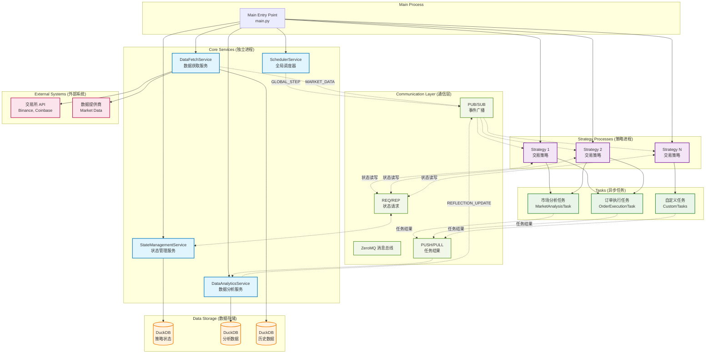

# Snail Trader

一个能够智能反思学习的慢速交易系统。

---

# Quantitative Trading Framework - ZeroMQ 分布式量化调度框架

基于 ZeroMQ 的高性能、容错的分布式量化交易框架，支持实时交易和回测，具备智能反思学习能力。

## 🏗️ 系统架构



## 🚀 核心特性

### **分布式架构**
- **进程隔离**: 每个服务运行在独立进程中，实现故障隔离
- **ZeroMQ 通信**: 高性能消息传递，支持多种通信模式
- **异步执行**: 非阻塞 I/O，最大化系统吞吐量

### **双模式运行**
- **实时模式 (Live)**: 基于时间调度的实时交易
- **回测模式 (Backtest)**: 基于历史数据的事件驱动回测

### **高级状态管理**
- **故障恢复**: 自动状态持久化和恢复
- **状态版本控制**: 支持多版本状态回滚
- **DuckDB 存储**: 高性能嵌入式分析数据库

### **灵活任务系统**
- **独立调度**: 任务拥有自己的执行周期
- **异步处理**: 非阻塞任务执行
- **结果分析**: 自动收集和分析任务执行结果

### **智能反思机制**
- **数据驱动优化**: 基于任务执行结果自动调整策略参数
- **性能分析**: 实时监控策略表现和风险指标
- **自适应学习**: 根据市场条件动态调整交易逻辑

## 📁 量化框架目录结构

```
├── core/                   # 核心框架组件
│   ├── __init__.py
│   ├── base.py            # 抽象基类 (Service, Strategy, Task)
│   ├── message_bus.py     # ZeroMQ 通信封装
│   └── constants.py       # 主题和端口定义
├── services/              # 服务实现
│   ├── scheduler_service.py      # 全局调度服务
│   ├── data_fetch_service.py     # 数据获取服务
│   ├── data_analytics_service.py # 数据分析服务
│   └── state_management_service.py # 状态管理服务
├── strategies/            # 交易策略实现
│   └── example_strategy.py       # 示例交易策略
├── tasks/                 # 任务实现
│   ├── market_analysis_task.py   # 市场分析任务
│   └── order_execution_task.py   # 订单执行任务
├── config/                # 量化框架配置
│   ├── base.yaml         # 基础配置（已扩展）
│   └── backtest.yaml     # 回测配置
└── main.py               # 框架入口点（已扩展）
```

## 🔧 量化框架安装

### **新增依赖**
```bash
# 激活虚拟环境
source .venv/bin/activate

# 安装量化框架依赖
uv add pyzmq duckdb
```

### **配置文件说明**

量化框架的配置已添加到 `configs/base.yaml` 中：

```yaml
# 量化框架配置
framework:
  mode: live                           # 运行模式: 'live' 或 'backtest'
  global_step_interval_minutes: 5      # 全局步进间隔（分钟）
  
  ports:                               # ZeroMQ 端口配置
    global_events: 5555                # 全局事件 PUB/SUB
    market_data: 5556                  # 市场数据 PUB/SUB
    task_results: 5557                 # 任务结果 PUSH/PULL
    state_management: 5558             # 状态管理 REQ/REP
  
  database:                            # 数据库配置
    state_db_path: data/states.db      # 状态数据库
    analytics_db_path: data/analytics.db # 分析数据库
    historical_db_path: data/historical.db # 历史数据库

# 策略配置
strategies:
  example_btc_strategy:
    symbols: ['BTC/USDT', 'ETH/USDT']
    initial_capital: 10000
    position_size: 1000
    risk_threshold: 0.02
```

## 🎯 量化框架使用

### **实时交易模式**
```bash
python main.py base  # 使用 configs/base.yaml（实时模式）
```

### **回测模式**
```bash
python main.py backtest  # 使用 configs/backtest.yaml（回测模式）
```

### **自定义配置**
```bash
python main.py my_config  # 使用 configs/my_config.yaml
```

## 📊 通信模式详解

### **PUB/SUB 主题**
- `GLOBAL_STEP`: 调度器发送的全局步进信号
- `MARKET_DATA`: 实时和历史市场数据
- `REFLECTION_UPDATE`: 基于分析的策略更新建议
- `DATA_PROCESSED`: 回测模式数据处理信号

### **PUSH/PULL 队列**
- `TASK_RESULTS`: 任务执行结果收集

### **REQ/REP 服务**
- 状态管理: `save_state()`, `load_state()`, `load_state_version()`

## 🔄 数据流详解

### **实时模式流程**
1. **SchedulerService** 每 N 分钟发布 `GLOBAL_STEP`
2. **策略** 接收步进信号并执行交易逻辑  
3. **任务** 被策略生成，拥有独立调度周期
4. **DataFetchService** 提供实时市场数据
5. **任务结果** 被 **DataAnalyticsService** 收集
6. **分析服务** 满足条件时触发反思更新

### **回测模式流程**
1. **DataFetchService** 按时间顺序读取历史数据
2. **市场数据** 为每个历史点位发布数据
3. **DATA_PROCESSED** 信号触发下一个调度步骤
4. **策略** 处理历史数据如同实时数据
5. **结果** 被收集用于回测分析

## 🛠️ 框架扩展

### **新增策略**

1. **创建策略类**:
```python
from core import AbstractStrategy
from tasks import MarketAnalysisTask, OrderExecutionTask

class MyTradingStrategy(AbstractStrategy):
    async def step(self):
        await super().step()
        
        # 市场分析
        await self._analyze_market()
        
        # 生成交易信号
        signals = await self._generate_signals()
        
        # 执行交易
        if signals:
            self.spawn_task(OrderExecutionTask, signals)
```

2. **更新配置**:
```yaml
strategies:
  my_strategy:
    symbols: ['BTC/USDT']
    initial_capital: 10000
    # 策略特定参数
```

### **创建自定义任务**

1. **实现任务类**:
```python
from core import AbstractTask

class CustomAnalysisTask(AbstractTask):
    async def execute(self) -> Dict[str, Any]:
        # 实现自定义分析逻辑
        result = await self._perform_analysis()
        return {
            'task_type': 'custom_analysis',
            'result': result
        }
```

2. **从策略中调用**:
```python
# 在策略的 step() 方法中
task_params = {'analysis_type': 'momentum'}
self.spawn_task(CustomAnalysisTask, task_params)
```

### **添加新服务**

1. **继承 AbstractService**:
```python
from core import AbstractService

class CustomService(AbstractService):
    async def async_run(self):
        await self.initialize()
        # 实现服务逻辑
        await self.cleanup()
```

2. **在 main.py 中启动**:
```python
# 在 _start_core_services() 中添加
custom_service = CustomService(self.config_dict)
custom_service.start()
self.processes.append(custom_service)
```

## 📈 分析和监控

### **内置分析功能**
- **策略性能**: 成功率、执行指标
- **错误模式检测**: 自动错误分析  
- **反思更新**: 数据驱动的策略优化

### **可用指标**
- 交易成功/失败率
- 执行质量评分
- 滑点分析
- 风险敞口跟踪

### **自定义分析**
扩展 `DataAnalyticsService` 添加自定义分析:
```python
async def _run_custom_analysis(self):
    # 实现自定义分析逻辑
    pass
```

## 🔒 风险管理

### **内置风险控制**
- 仓位大小限制
- 组合敞口检查
- 日损失限制
- 交易时段验证

### **配置示例**
```yaml
strategies:
  my_strategy:
    risk_threshold: 0.02    # 每笔交易最大风险2%
    position_size: 1000     # 最大仓位大小
    max_daily_trades: 50    # 每日交易频率限制
```

## 🐛 调试和日志

### **日志级别**
- 服务特定的日志配置
- 详细的任务执行日志
- 性能指标日志

### **调试模式**
```yaml
logging:
  level: DEBUG
  services:
    strategies: DEBUG
    tasks: DEBUG
```

## ⚡ 性能优化

### **推荐设置**
- 使用适当的 ZeroMQ 套接字类型
- 配置最佳批处理大小
- 调整数据库连接池
- 为生产环境设置合适的日志级别

### **扩展考虑**
- 每个服务可部署到不同机器
- 大型数据集的数据库分片
- 策略进程的负载均衡

---

## 快速开始

### 环境设置

1. 激活虚拟环境并安装依赖：
```bash
source .venv/bin/activate
uv install
```

2. 配置环境变量：
```bash
cp .env.example .env
# 编辑 .env 文件，添加你的API密钥
```

## 配置系统使用

### 1. 基本配置加载

```python
from utils.config_utils import Config

# 加载默认配置 (base.yaml)
config = Config()

# 加载特定环境配置 (如 configs/ollama.yaml)
config = Config("ollama")

# 访问配置项
settings = config.settings
market_universe = settings.market.universe
llm_providers = settings.llm['providers']
```

### 2. 配置文件结构

- `configs/base.yaml` - 基础配置
- `configs/{env}.yaml` - 环境特定配置（如 `ollama.yaml`）

### 3. 环境变量支持

配置文件中使用 `${VAR_NAME}` 语法引用环境变量：

```yaml
llm:
  providers:
    gpt_light:
      api_key: ${GEMINI_API_KEY}
      base_url: https://api.example.com/v1
```

### 4. 在组件中使用

```python
# 在LLM API中使用
from utils.config_utils import Config

def initialize_llm(config_name="base"):
    config_loader = Config(config_name)
    providers = config_loader.llm.providers
    # 使用配置初始化LLM提供者...
```

### 5. 命令行指定配置

```bash
# 通过命令行参数指定配置
python your_script.py --config ollama

# 或通过环境变量
export CONFIG_NAME=ollama
python your_script.py
```

## 抽象调度框架

### 框架概述

项目包含一个通用的抽象调度框架（`core/`），可用于构建各种任务调度系统。框架具有高度抽象性和可扩展性。

### 核心组件

- **Task** - 最抽象的任务单元，定义 `execute()` 方法
- **ScheduledTask** - 可条件调度的任务，增加 `should_run()` 判断逻辑
- **Context** - 通用上下文容器，用于存储和传递数据
- **Lifecycle** - 生命周期管理，提供各阶段的钩子函数
- **Engine** - 调度引擎，协调任务执行和生命周期管理
- **Registry** - 组件注册表，管理组件的创建和获取

### 快速使用示例

```python
from core import Engine, Context, Task, ScheduledTask, Lifecycle

# 1. 定义任务
class DataTask(Task):
    def execute(self, context):
        # 数据收集逻辑
        data = self.collect_data()
        context.set('data', data)
        return data

class AnalysisTask(ScheduledTask):
    def should_run(self, context):
        return context.has('data')
    
    def execute(self, context):
        # 分析逻辑
        data = context.get('data')
        return self.analyze(data)

# 2. 定义生命周期
class ConfigManager(Lifecycle):
    def before_step(self, context):
        # 加载最新配置
        context.set('config', self.load_config())
        return context

# 3. 组装和运行
engine = Engine()
engine.register_task(DataTask())
engine.register_task(AnalysisTask())
engine.register_lifecycle(ConfigManager())

# 运行单步
context = Context()
results = engine.step(context)

# 或运行主循环
engine.run(lambda: Context(), interval=1.0)
```

### 详细组件说明

#### 1. Context（上下文容器）
上下文是框架中数据传递的核心，类似于一个智能字典：

```python
from core import Context

# 基本操作
context = Context()
context.set('key', 'value')           # 设置值
value = context.get('key')            # 获取值
exists = context.has('key')           # 检查是否存在
context.delete('key')                 # 删除键值对

# 元数据操作
context.set_metadata('version', '1.0')  # 设置元数据
version = context.get_metadata('version')  # 获取元数据

# 上下文合并和复制
ctx1 = Context()
ctx1.set('a', 1)
ctx2 = Context() 
ctx2.set('b', 2)
merged = ctx1.merge(ctx2)             # 合并上下文
copied = ctx1.copy()                  # 复制上下文
```

**使用场景**：
- 在任务间传递数据（如市场数据、配置信息）
- 存储中间计算结果
- 维护系统状态信息

#### 2. Task（基础任务）
最简单的任务单元，每次调用时都会执行：

```python
from core import Task, Context

class MarketDataTask(Task):
    def __init__(self, symbol='BTCUSDT'):
        self.symbol = symbol
    
    def execute(self, context: Context):
        # 获取实时市场数据
        price = self.fetch_current_price(self.symbol)
        context.set(f'price_{self.symbol}', price)
        return price
    
    def fetch_current_price(self, symbol):
        # 实际API调用逻辑
        return 50000  # 示例价格
```

**使用场景**：
- 数据收集任务
- 基础计算任务
- 系统初始化任务

#### 3. ScheduledTask（条件调度任务）
只有满足特定条件时才执行的任务：

```python
from core import ScheduledTask, Context

class TradingSignalTask(ScheduledTask):
    def __init__(self, strategy_name='momentum'):
        self.strategy_name = strategy_name
        self.last_signal_time = 0
    
    def should_run(self, context: Context) -> bool:
        # 检查执行条件
        has_data = context.has('price_BTCUSDT')
        time_elapsed = time.time() - self.last_signal_time > 60  # 至少间隔1分钟
        return has_data and time_elapsed
    
    def execute(self, context: Context):
        price = context.get('price_BTCUSDT')
        
        # 简单动量策略
        if price > self.get_ma20():
            signal = 'BUY'
        elif price < self.get_ma20():
            signal = 'SELL'
        else:
            signal = 'HOLD'
        
        self.last_signal_time = time.time()
        context.set('trading_signal', signal)
        return signal
    
    def get_ma20(self):
        # 获取20日移动平均线
        return 48000
```

**使用场景**：
- 交易信号生成（只在有数据时执行）
- 风险检查（只在仓位变化时执行）
- 报告生成（只在特定时间执行）

#### 4. Lifecycle（生命周期管理）
提供系统执行各阶段的钩子函数：

```python
from core import Lifecycle, Context

class RiskManager(Lifecycle):
    def __init__(self, max_loss=0.02):
        self.max_loss = max_loss
        self.initial_balance = 10000
    
    def before_step(self, context: Context) -> Context:
        """每步执行前的准备工作"""
        # 更新账户状态
        current_balance = self.get_current_balance()
        context.set('account_balance', current_balance)
        
        # 检查风险限制
        loss_ratio = (self.initial_balance - current_balance) / self.initial_balance
        context.set('risk_level', 'HIGH' if loss_ratio > self.max_loss else 'NORMAL')
        
        return context
    
    def after_step(self, context: Context, results):
        """每步执行后的清理工作"""
        # 记录执行结果
        self.log_results(results)
        
        # 检查紧急停止条件
        if context.get('risk_level') == 'HIGH':
            print("⚠️ 风险水平过高，暂停交易")
    
    def on_error(self, context: Context, error: Exception) -> bool:
        """错误处理"""
        print(f"❌ 执行出错: {error}")
        
        # 根据错误类型决定是否继续
        if isinstance(error, ConnectionError):
            print("🔄 网络错误，将重试")
            return True  # 继续执行
        else:
            print("🛑 严重错误，停止执行")
            return False  # 停止执行
    
    def before_engine_start(self, context: Context) -> Context:
        """引擎启动前的初始化"""
        print("🚀 交易系统启动")
        context.set('start_time', time.time())
        return context
    
    def after_engine_stop(self, context: Context):
        """引擎停止后的清理"""
        duration = time.time() - context.get('start_time', 0)
        print(f"⏹️ 交易系统停止，运行时长: {duration:.2f}秒")
    
    def get_current_balance(self):
        return 9800  # 示例余额
    
    def log_results(self, results):
        pass  # 日志记录逻辑
```

**生命周期钩子说明**：
- `before_engine_start`: 引擎启动前（系统初始化）
- `after_engine_stop`: 引擎停止后（资源清理）
- `before_step`: 每步执行前（数据准备、状态检查）
- `after_step`: 每步执行后（结果处理、状态更新）
- `on_error`: 错误发生时（错误处理、恢复策略）

#### 5. Engine（调度引擎）
协调所有组件的执行：

```python
from core import Engine, Context

# 创建引擎
engine = Engine()

# 注册任务（按注册顺序执行）
engine.register_task(MarketDataTask('BTCUSDT'))
engine.register_task(MarketDataTask('ETHUSDT'))
engine.register_task(TradingSignalTask())

# 注册生命周期管理器
engine.register_lifecycle(RiskManager(max_loss=0.03))

# 单步执行
context = Context()
results = engine.step(context)
print(f"执行结果: {results}")

# 持续运行
def create_context():
    ctx = Context()
    ctx.set('timestamp', time.time())
    return ctx

# 每5秒执行一次
engine.run(create_context, interval=5.0)
```

#### 6. Registry（组件注册表）
统一管理组件的创建和获取：

```python
from core import Registry

registry = Registry()

# 注册类
registry.register('market_data', MarketDataTask)
registry.register('trading_signal', TradingSignalTask)

# 注册工厂函数
def create_btc_task():
    return MarketDataTask('BTCUSDT')

def create_eth_task():
    return MarketDataTask('ETHUSDT')

registry.register_factory('btc_data', create_btc_task)
registry.register_factory('eth_data', create_eth_task)

# 创建组件
btc_task = registry.create('btc_data')
signal_task = registry.create('trading_signal', 'advanced')

# 查看注册的组件
components = registry.list_components()
print(f"已注册组件: {components}")
```

### 实际应用示例

#### 完整交易系统示例

```python
from core import Engine, Context, Task, ScheduledTask, Lifecycle
import time

class DataCollector(Task):
    """市场数据收集器"""
    def execute(self, context: Context):
        # 模拟获取多个交易对的数据
        data = {
            'BTCUSDT': {'price': 45000, 'volume': 1000},
            'ETHUSDT': {'price': 3000, 'volume': 800}
        }
        context.set('market_data', data)
        return data

class StrategyEngine(ScheduledTask):
    """策略引擎：只在有新数据时运行"""
    def should_run(self, context: Context) -> bool:
        return context.has('market_data') and not context.has('positions_checked')
    
    def execute(self, context: Context):
        market_data = context.get('market_data')
        signals = {}
        
        for symbol, data in market_data.items():
            if data['price'] > self.get_sma20(symbol):
                signals[symbol] = 'BUY'
            elif data['price'] < self.get_sma20(symbol):
                signals[symbol] = 'SELL'
            else:
                signals[symbol] = 'HOLD'
        
        context.set('trading_signals', signals)
        context.set('positions_checked', True)
        return signals
    
    def get_sma20(self, symbol):
        # 模拟获取20日均线
        return {'BTCUSDT': 44000, 'ETHUSDT': 2900}.get(symbol, 0)

class OrderManager(ScheduledTask):
    """订单管理器：只在有交易信号时执行"""
    def should_run(self, context: Context) -> bool:
        return context.has('trading_signals')
    
    def execute(self, context: Context):
        signals = context.get('trading_signals')
        orders = []
        
        for symbol, signal in signals.items():
            if signal in ['BUY', 'SELL']:
                order = {
                    'symbol': symbol,
                    'side': signal.lower(),
                    'quantity': self.calculate_position_size(symbol, context),
                    'timestamp': time.time()
                }
                orders.append(order)
        
        context.set('pending_orders', orders)
        return orders
    
    def calculate_position_size(self, symbol, context):
        balance = context.get('account_balance', 10000)
        return balance * 0.1  # 10%仓位

class SystemMonitor(Lifecycle):
    """系统监控器"""
    def __init__(self):
        self.step_count = 0
        self.error_count = 0
    
    def before_step(self, context: Context):
        self.step_count += 1
        context.set('step_number', self.step_count)
        context.set('account_balance', 10000)  # 模拟账户余额
        return context
    
    def after_step(self, context: Context, results):
        orders = context.get('pending_orders', [])
        if orders:
            print(f"📊 第{self.step_count}步: 生成{len(orders)}个订单")
        
        # 清理临时状态
        context.delete('positions_checked')
    
    def on_error(self, context: Context, error: Exception) -> bool:
        self.error_count += 1
        print(f"❌ 错误 #{self.error_count}: {error}")
        return self.error_count < 3  # 最多容忍3个错误

# 组装系统
def run_trading_system():
    engine = Engine()
    
    # 注册任务（执行顺序很重要）
    engine.register_task(DataCollector())
    engine.register_task(StrategyEngine())
    engine.register_task(OrderManager())
    
    # 注册生命周期管理
    engine.register_lifecycle(SystemMonitor())
    
    print("🚀 交易系统启动")
    
    # 运行几个周期进行演示
    for i in range(3):
        print(f"\n--- 执行第{i+1}个周期 ---")
        context = Context()
        context.set('cycle', i+1)
        
        try:
            results = engine.step(context)
            print(f"✅ 执行完成，结果数: {len(results)}")
        except Exception as e:
            print(f"❌ 执行失败: {e}")
        
        time.sleep(1)  # 间隔1秒

if __name__ == "__main__":
    run_trading_system()
```

### 最佳实践

#### 1. 任务设计原则
```python
# ✅ 好的做法：任务职责单一
class MarketDataCollector(Task):
    def execute(self, context):
        data = self.fetch_market_data()
        context.set('market_data', data)
        return data

# ❌ 不好的做法：任务职责过重
class EverythingTask(Task):
    def execute(self, context):
        data = self.fetch_market_data()
        signal = self.generate_signal(data)
        order = self.create_order(signal)
        self.execute_order(order)  # 太多责任
```

#### 2. 上下文键命名规范
```python
# ✅ 使用清晰的命名空间
context.set('market.btc.price', 50000)
context.set('strategy.momentum.signal', 'BUY')
context.set('risk.current_exposure', 0.8)

# ✅ 使用描述性名称
context.set('last_price_update_time', time.time())
context.set('active_positions_count', 5)
```

#### 3. 生命周期钩子使用
```python
class SmartLifecycle(Lifecycle):
    def before_step(self, context):
        # ✅ 在这里做数据准备和验证
        if not self.validate_market_hours():
            context.set('skip_trading', True)
        return context
    
    def after_step(self, context, results):
        # ✅ 在这里做清理和状态更新
        self.update_performance_metrics(results)
        self.cleanup_expired_data(context)
    
    def on_error(self, context, error):
        # ✅ 根据错误类型决定处理策略
        if isinstance(error, NetworkError):
            return True  # 网络错误可以重试
        elif isinstance(error, ValidationError):
            return False  # 数据错误需要人工介入
        return True
```

#### 4. 错误处理策略
```python
class RobustTask(Task):
    def __init__(self):
        self.retry_count = 0
        self.max_retries = 3
    
    def execute(self, context):
        try:
            return self.do_work(context)
        except RetryableError as e:
            self.retry_count += 1
            if self.retry_count < self.max_retries:
                context.set('task_needs_retry', True)
                raise  # 让生命周期处理重试
            else:
                raise FatalError(f"Task failed after {self.max_retries} retries")
```

### 扩展点详解

#### 自定义任务扩展
```python
# 继承Task实现自定义业务逻辑
class CustomAnalysisTask(Task):
    def __init__(self, analysis_type='technical'):
        self.analysis_type = analysis_type
        self.analyzer = self.create_analyzer()
    
    def execute(self, context):
        market_data = context.get('market_data')
        if not market_data:
            return None
        
        analysis_result = self.analyzer.analyze(market_data)
        context.set(f'analysis_{self.analysis_type}', analysis_result)
        return analysis_result
    
    def create_analyzer(self):
        if self.analysis_type == 'technical':
            return TechnicalAnalyzer()
        elif self.analysis_type == 'fundamental':
            return FundamentalAnalyzer()
        else:
            raise ValueError(f"Unsupported analysis type: {self.analysis_type}")

# 继承ScheduledTask实现条件执行
class TimedTask(ScheduledTask):
    def __init__(self, interval_seconds=60):
        self.interval = interval_seconds
        self.last_run = 0
    
    def should_run(self, context):
        current_time = time.time()
        return current_time - self.last_run >= self.interval
    
    def execute(self, context):
        self.last_run = time.time()
        return self.do_scheduled_work(context)
    
    def do_scheduled_work(self, context):
        # 子类实现具体逻辑
        raise NotImplementedError
```

#### 生命周期扩展
```python
class AdvancedMonitoring(Lifecycle):
    def __init__(self):
        self.metrics = {}
        self.alerts = []
    
    def before_engine_start(self, context):
        print("🔧 系统预检查...")
        self.run_system_checks()
        context.set('system_status', 'healthy')
        return context
    
    def before_step(self, context):
        # 性能监控
        context.set('step_start_time', time.time())
        return context
    
    def after_step(self, context, results):
        # 计算性能指标
        duration = time.time() - context.get('step_start_time', 0)
        self.metrics['avg_step_duration'] = self.update_average(duration)
        
        # 检查告警条件
        if duration > 5.0:  # 步骤执行超过5秒
            self.alerts.append(f"慢查询告警: 步骤耗时{duration:.2f}秒")
    
    def run_system_checks(self):
        # 检查系统资源、网络连接等
        pass
```

#### 上下文扩展
```python
class SmartContext(Context):
    """扩展上下文，添加类型检查和缓存功能"""
    
    def __init__(self):
        super().__init__()
        self.cache = {}
        self.cache_ttl = {}
    
    def set_with_ttl(self, key, value, ttl_seconds=300):
        """设置带过期时间的值"""
        self.set(key, value)
        self.cache_ttl[key] = time.time() + ttl_seconds
    
    def get(self, key, default=None):
        """获取值，自动检查过期"""
        if key in self.cache_ttl:
            if time.time() > self.cache_ttl[key]:
                self.delete(key)
                del self.cache_ttl[key]
                return default
        return super().get(key, default)
    
    def get_typed(self, key, expected_type, default=None):
        """获取指定类型的值"""
        value = self.get(key, default)
        if value is not None and not isinstance(value, expected_type):
            raise TypeError(f"Expected {expected_type}, got {type(value)}")
        return value
```

### 运行测试示例

```bash
# 激活虚拟环境
source .venv/bin/activate

# 运行框架测试示例（带中文注释）
python test/test_core_framework.py
```

测试文件展示了框架的完整使用方式，包括：

#### 测试覆盖的功能点：
1. **基本框架功能测试** (`test_basic_framework`)
   - 引擎创建和任务注册
   - 生命周期管理器注册
   - 单步执行和结果处理

2. **组件注册表测试** (`test_registry`)
   - 类注册和工厂函数注册
   - 动态组件创建
   - 注册表内容查询

3. **上下文操作测试** (`test_context_operations`)
   - 基本数据存储和获取
   - 上下文合并和复制
   - 元数据操作

4. **调度任务测试** (`test_scheduled_tasks`)
   - 条件判断逻辑
   - 任务跳过机制
   - 状态依赖执行

5. **错误处理测试** (`test_error_handling`)
   - 异常捕获和处理
   - 错误恢复策略
   - 系统稳定性保证

#### 测试输出示例：
```
=== 测试基本框架 ===
=== 引擎启动 ===
配置重新加载到版本 1
第 1 步完成，产生了 2 个结果
=== 引擎停止 (运行了 0.01秒) ===
结果: [market_data_dict, trading_signal]
上下文数据: {'system_time': 1691234567.89, 'config_version': 1, ...}

=== 测试注册表 ===
创建的任务: DataCollectionTask, DataCollectionTask
注册表内容: ['data_task', 'strategy_task', 'custom_data_task']

=== 所有测试完成 ===
```

### 性能优化建议

#### 1. 任务执行优化
```python
# ✅ 使用缓存避免重复计算
class CachedAnalysisTask(Task):
    def __init__(self):
        self.result_cache = {}
    
    def execute(self, context):
        data_hash = hash(str(context.get('market_data')))
        if data_hash in self.result_cache:
            return self.result_cache[data_hash]
        
        result = self.perform_analysis(context)
        self.result_cache[data_hash] = result
        return result

# ✅ 异步任务支持
class AsyncDataTask(Task):
    async def execute_async(self, context):
        data = await self.fetch_async_data()
        context.set('async_data', data)
        return data
```

#### 2. 内存管理
```python
class MemoryEfficientLifecycle(Lifecycle):
    def after_step(self, context, results):
        # 清理过期的上下文数据
        self.cleanup_old_data(context)
        
        # 限制历史数据保存量
        history = context.get('price_history', [])
        if len(history) > 1000:
            context.set('price_history', history[-500:])  # 只保留最新500条
    
    def cleanup_old_data(self, context):
        current_time = time.time()
        keys_to_remove = []
        
        for key in context.keys():
            if key.endswith('_timestamp'):
                timestamp = context.get(key)
                if current_time - timestamp > 3600:  # 超过1小时的数据
                    keys_to_remove.append(key.replace('_timestamp', ''))
                    keys_to_remove.append(key)
        
        for key in keys_to_remove:
            context.delete(key)
```

## 项目结构

```
snail_trader/
├── configs/           # 配置文件
├── core/              # 抽象调度框架
│   ├── __init__.py
│   ├── task.py        # 任务抽象
│   ├── context.py     # 上下文容器
│   ├── lifecycle.py   # 生命周期管理
│   ├── engine.py      # 调度引擎
│   └── registry.py    # 组件注册表
├── llm_api/          # LLM API接口
├── utils/            # 工具函数
├── notebook/         # Jupyter notebooks
└── test/             # 测试文件
```

## Git子模块管理

将来如果需要同时拉取主仓库和子模块，可以使用：
```bash
git clone --recurse-submodules https://github.com/your-repo.git

# 如果已经克隆了主仓库但子模块为空，使用：
git submodule init
git submodule update

# 或者一条命令：
git submodule update --init --recursive

# 更新子模块到最新版本：
git submodule update --remote
```